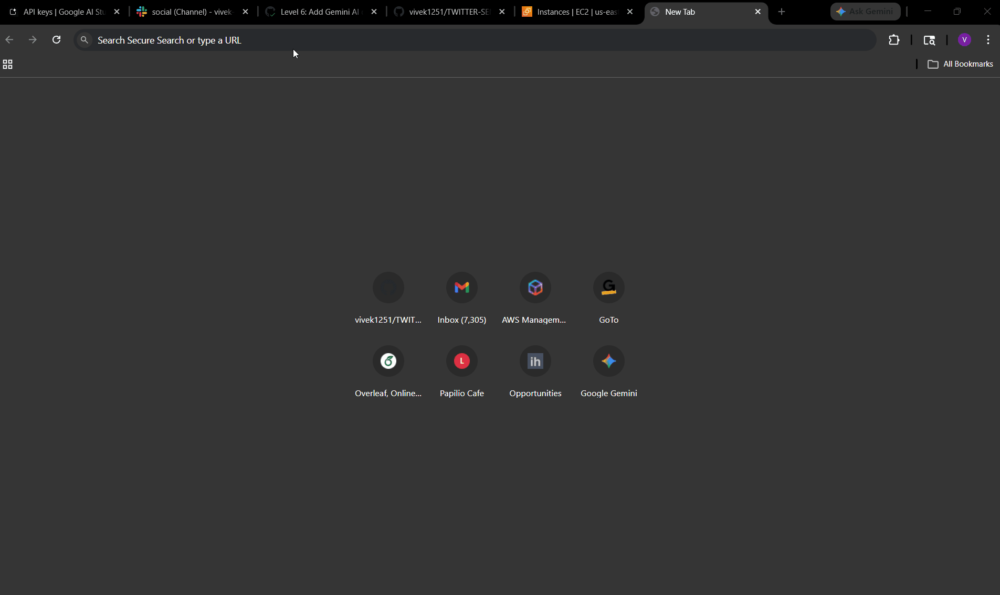
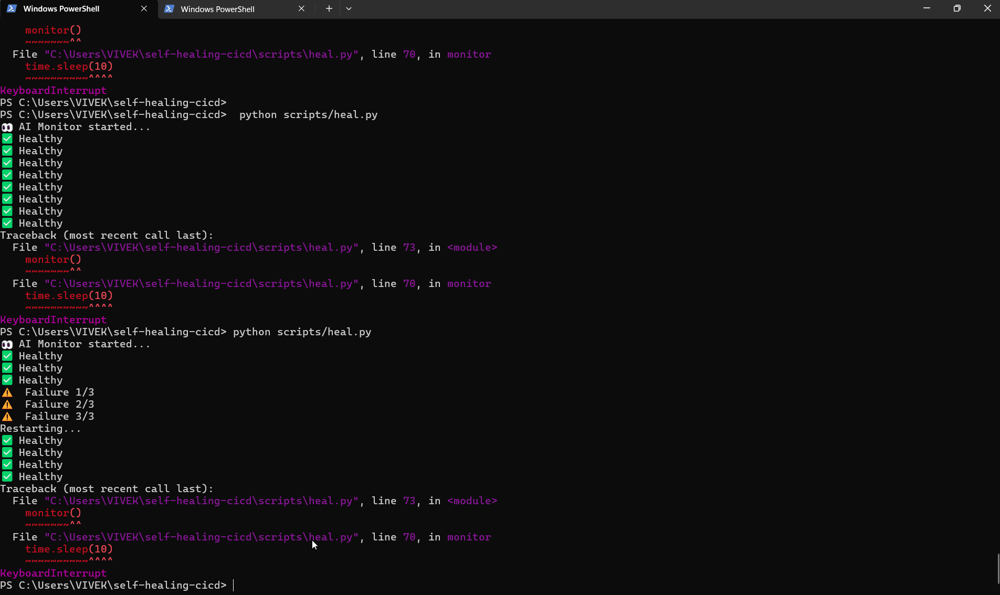
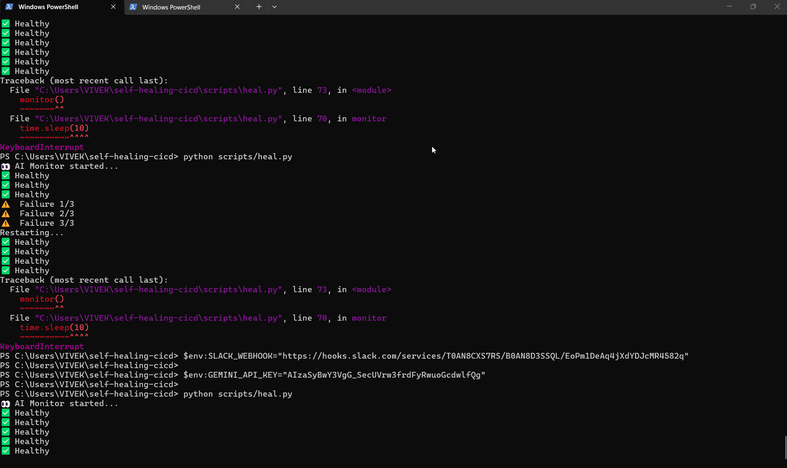
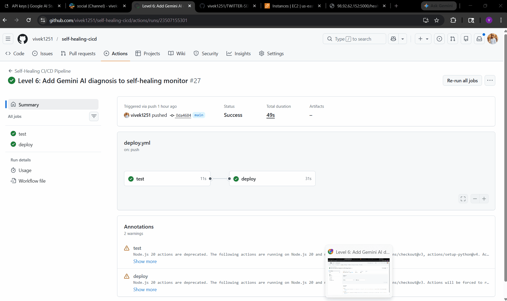
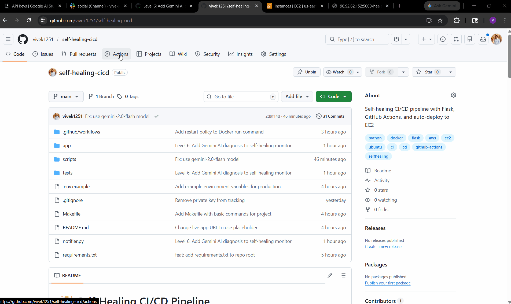

# 🤖 Self-Healing CI/CD Pipeline with Gemini AI


<div align="center">


**A production-grade, fully automated DevOps system that detects application failures, uses Gemini AI to diagnose root causes from Docker logs, auto-restarts containers, and sends real-time Slack alerts — all without human intervention.**

[🌐 Live Demo](YOUR_EC2_IP) • [📦 DockerHub](https://hub.docker.com/u/vivekbommalla1251) • [⚙️ GitHub Actions](https://github.com/vivek1251/self-healing-cicd/actions)

</div>

---

## 📌 What Makes This Project Stand Out

Most CI/CD pipelines just deploy code. This one **heals itself**. When the app crashes:

1. The monitor detects it within 30 seconds
2. Gemini AI reads the Docker logs and explains exactly what went wrong
3. The container is automatically restarted — no human needed
4. Your team gets a Slack notification with the AI's diagnosis

This is what **Site Reliability Engineering (SRE)** looks like in practice.

---
## 🎬 Demo

### Monitor starting & app healthy


### Crash detected — self-healing triggered


### AI diagnosis + auto-restart


### Slack alerts firing in real time


### GitHub Actions pipeline running


---
## 🏗️ System Architecture

```
┌─────────────────────────────────────────────────────────────────┐
│                        DEVELOPER MACHINE                        │
│                                                                 │
│   git push origin main                                          │
│         │                                                       │
└─────────┼───────────────────────────────────────────────────────┘
          │
          ▼
┌─────────────────────────────────────────────────────────────────┐
│                      GITHUB ACTIONS CI/CD                       │
│                                                                 │
│   1. Checkout Code                                              │
│   2. docker build -t vivekbommalla1251/self-healing-app:latest  │
│   3. docker push → DockerHub Registry                           │
│   4. SSH into EC2 → docker pull → docker run                    │
│                                                                 │
└─────────────────────────────────────────────────────────────────┘
          │
          ▼
┌─────────────────────────────────────────────────────────────────┐
│                      AWS EC2 (PRODUCTION)                       │
│                                                                 │
│  ┌──────────────────┐       ┌──────────────────────────────┐   │
│  │  Flask App       │       │  heal.py (AI Monitor)        │   │
│  │  :5000/health    │◄──────│  Polls every 10 seconds      │   │
│  │  {"status":"ok"} │       │  3 failures → restart        │   │
│  └──────────────────┘       └──────────────┬───────────────┘   │
│                                            │                   │
└────────────────────────────────────────────┼───────────────────┘
                                             │
                          ┌──────────────────▼───────────────────┐
                          │         ON CRASH DETECTED            │
                          │                                      │
                          │  1. Get last 20 lines of logs        │
                          │  2. Send to Gemini AI for analysis   │
                          │  3. Restart Docker container         │
                          │  4. Send Slack alert with diagnosis  │
                          │                                      │
                          └──────────────────────────────────────┘
```

---

## ⚡ Key Features

| Feature | Description |
|---|---|
| 🐍 **Flask REST API** | Lightweight Python web server with `/health` endpoint |
| 🐳 **Dockerized App** | Containerized with Python 3.11-slim for minimal image size |
| 📦 **DockerHub Registry** | Versioned images pushed and pulled automatically |
| ⚙️ **GitHub Actions** | Zero-touch CI/CD — every `git push` triggers full deploy |
| ☁️ **AWS EC2 Deployment** | Auto SSH deploy to cloud on every pipeline run |
| 🔄 **Self-Healing Monitor** | Detects 3 consecutive failures and auto-restarts container |
| 🤖 **Gemini AI Diagnosis** | AI reads Docker logs and explains root cause in plain English |
| 🔔 **Slack Alerts** | Real-time notifications for crashes, AI diagnosis, and recovery |
| 🧪 **Automated Tests** | pytest suite runs on every push before deployment |
| 🔒 **Secrets Management** | Zero hardcoded credentials — all via GitHub Secrets & env vars |

---

## 📁 Project Structure

```
self-healing-cicd/
│
├── app/
│   ├── app.py                  # Flask REST API application
│   ├── Dockerfile              # Container build instructions
│   └── requirements.txt        # Python dependencies
│
├── scripts/
│   └── heal.py                 # AI-powered self-healing monitor
│
├── tests/
│   ├── __init__.py
│   └── test_app.py             # pytest unit tests
│
├── notifier.py                 # Standalone Slack + Gemini alert module
│
├── .github/
│   └── workflows/
│       └── deploy.yml          # Full CI/CD pipeline definition
│
├── .gitignore
└── README.md
```

---

## 🛠️ Tech Stack

| Layer | Technology | Purpose |
|---|---|---|
| **Application** | Python 3.11 + Flask | REST API server |
| **Containerization** | Docker | Portable, reproducible runtime |
| **Registry** | DockerHub | Remote image storage |
| **CI/CD** | GitHub Actions | Automated build, test, deploy |
| **Cloud** | AWS EC2 | Production server |
| **AI** | Google Gemini 2.0 | Intelligent log diagnosis |
| **Alerting** | Slack Webhooks | Real-time team notifications |
| **Testing** | pytest | Automated unit testing |
| **Language** | Python 92.9%, Dockerfile 7.1% | As measured by GitHub |

---

## 🔄 How the Self-Healing Works

```
heal.py runs on EC2 (as background process)
         │
         ▼
  Check /health endpoint every 10 seconds
         │
    ┌────┴────┐
    │         │
  200 OK    Failure
    │         │
  failures=0  failures += 1
              │
        failures >= 3?
              │
           ┌──┴───┐
           │  YES  │
           └──┬───┘
              │
    ┌─────────▼─────────┐
    │ Get container logs │  docker logs --tail 20 myapp
    └─────────┬─────────┘
              │
    ┌─────────▼──────────────┐
    │ Send logs to Gemini AI  │  gemini-2.0-flash model
    │ "Explain what went wrong│  Returns 2-3 sentence diagnosis
    │  in 2-3 sentences"      │
    └─────────┬──────────────┘
              │
    ┌─────────▼──────────────┐
    │ Send Slack Alert        │  🔴 App DOWN + AI Diagnosis
    └─────────┬──────────────┘
              │
    ┌─────────▼──────────────┐
    │ docker stop myapp       │
    │ docker rm myapp         │
    │ docker run myapp        │  Fresh container from DockerHub
    └─────────┬──────────────┘
              │
    ┌─────────▼──────────────┐
    │ Send Slack Alert        │  🟢 App AUTO-RESTARTED
    └────────────────────────┘
```

---

## ⚙️ CI/CD Pipeline Breakdown

Every `git push` to `main` triggers this automated workflow in GitHub Actions:

```
Step 1 — Code Checkout
  └── actions/checkout@v3

Step 2 — Docker Login
  └── Uses DOCKER_USERNAME + DOCKER_PASSWORD secrets

Step 3 — Build Docker Image
  └── docker build -t vivekbommalla1251/self-healing-app:latest ./app

Step 4 — Push to DockerHub
  └── Image available globally for EC2 to pull

Step 5 — Run Tests
  └── pytest tests/ (must pass before deployment)

Step 6 — SSH Deploy to EC2
  └── Uses EC2_HOST, EC2_USER, EC2_KEY secrets
  └── docker pull latest image
  └── docker stop/rm old container
  └── docker run new container on :5000
```

**Result:** Zero-downtime deployment from code push to live server in under 2 minutes.

---

## 🔐 Secrets & Environment Variables

All credentials are stored securely — nothing is hardcoded in the codebase.

**GitHub Actions Secrets (for CI/CD):**

| Secret | Description |
|---|---|
| `DOCKER_USERNAME` | DockerHub account username |
| `DOCKER_PASSWORD` | DockerHub account password |
| `EC2_HOST` | AWS EC2 public IP address |
| `EC2_USER` | EC2 SSH username (ubuntu) |
| `EC2_KEY` | EC2 PEM private key (base64 encoded) |

**Runtime Environment Variables (for heal.py):**

| Variable | Description |
|---|---|
| `GEMINI_API_KEY` | Google AI Studio API key |
| `SLACK_WEBHOOK` | Slack incoming webhook URL |

---

## 🧪 Testing

The project includes automated unit tests that run on every CI/CD pipeline execution.

```bash
# Run tests locally
pytest tests/

# Run with verbose output
pytest tests/ -v
```

Tests validate the `/health` endpoint returns the correct response before any deployment proceeds.

---

## 🚀 Local Setup & Running

### Prerequisites

- Docker Desktop installed and running
- Python 3.11+
- Google Gemini API key ([Get free key](https://aistudio.google.com/app/apikey))
- Slack webhook URL

### 1. Clone the Repository

```bash
git clone https://github.com/vivek1251/self-healing-cicd.git
cd self-healing-cicd
```

### 2. Build and Run the App

```bash
# Build the Docker image
docker build -t self-healing-app:latest ./app

# Run the container
docker run -d --name myapp -p 5000:5000 self-healing-app:latest

# Verify it's healthy
curl http://localhost:5000/health
# → {"status": "healthy"}
```

### 3. Start the Self-Healing Monitor

```bash
# Set environment variables
export GEMINI_API_KEY="your-gemini-key"
export SLACK_WEBHOOK="your-slack-webhook-url"

# Start the AI monitor
python scripts/heal.py
```

### 4. Test the Self-Healing

In a second terminal, simulate a crash:

```bash
docker stop myapp
docker rm myapp
```

Watch the monitor terminal — you'll see:
```
👀 AI Monitor started...
⚠️  Failure 1/3
⚠️  Failure 2/3
⚠️  Failure 3/3
Restarting...
✅ Healthy
```

And check Slack for the AI-generated diagnosis alert.

---

## 🌐 API Endpoints

| Endpoint | Method | Response |
|----------|--------|----------|
| `/` | GET | `{"message": "Self-Healing CI/CD App", "version": "1.0"}` |
| `/health` | GET | `{"status": "healthy"}` |
| `/status` | GET | `{"status": "running", "uptime_seconds": ..., "version": "1.0"}` |
| `/metrics` | GET | Deployment stats, healing counts, alert summary |
| `/version` | GET | `{"version": "1.0.0", "build": "stable", "author": "vivek1251"}` |
| `/deployments` | GET | List of all deployments |
| `/deployments/<id>` | GET | Single deployment by ID |
| `/deployments` | POST | Create a new deployment record |
| `/alerts` | GET | All alerts (add `?unresolved=true` for open only) |

**Live endpoint:** http://YOUR_EC2_IP

---

## 📊 Slack Alert Notifications

The system sends 4 types of Slack alerts automatically:

| Event | Alert |
|---|---|
| Monitor starts | 🤖 *Gemini AI Monitor Started* — Watching your server |
| App crashes (3 failures) | 🔴 *App is DOWN!* + AI root cause diagnosis |
| Container restarting | ⚙️ *Auto-restarting now...* |
| Recovery confirmed | 🟢 *App AUTO-RESTARTED and healthy!* |

---

## ☁️ AWS EC2 Deployment

The app runs on an AWS EC2 instance, deployed automatically by GitHub Actions on every push.

```bash
# SSH into EC2
ssh -i your-key.pem ubuntu@YOUR_EC2_IP

# View running container
docker ps

# View heal.py logs
cat ~/heal.log

# Run monitor in background
export GEMINI_API_KEY="your-key"
export SLACK_WEBHOOK="your-webhook"
nohup python3 ~/scripts/heal.py > ~/heal.log 2>&1 &
```

---

## 🧠 Gemini AI Integration

The `heal.py` monitor uses the Google Gemini API (via `google-genai` SDK) to perform intelligent log analysis:

```python
def gemini_diagnose(logs):
    prompt = f"""You are a DevOps AI. Analyze these Docker logs and explain 
    in 2-3 sentences what went wrong:\n\n{logs}"""
    
    response = client.models.generate_content(
        model="gemini-2.0-flash", 
        contents=prompt
    )
    return response.text
```

The AI receives the last 20 lines of Docker container logs and returns a plain-English explanation of the failure — making it instantly actionable for any engineer receiving the Slack alert.

---

## 📈 Project Evolution

This project was built progressively, demonstrating real-world DevOps thinking:

| Level | What Was Built |
|---|---|
| 1 | Flask app + Docker containerization |
| 2 | GitHub Actions CI/CD pipeline |
| 3 | Self-healing monitor (basic restart) |
| 4 | Slack webhook alerts |
| 5 | AWS EC2 cloud deployment |
| 6 | Gemini AI log diagnosis integration |

---

## 👨‍💻 Author

**Vivek Bommalla**

- 🐙 GitHub: [@vivek1251](https://github.com/vivek1251)
- 🐳 DockerHub: [vivekbommalla1251](https://hub.docker.com/u/vivekbommalla1251)

---

## 📄 License

MIT License — feel free to fork and build on this project.

---

<div align="center">

**Built with Python · Docker · GitHub Actions · AWS · Gemini AI · Slack**

*Demonstrating end-to-end DevOps: from code to cloud, with AI-powered reliability*

</div>
